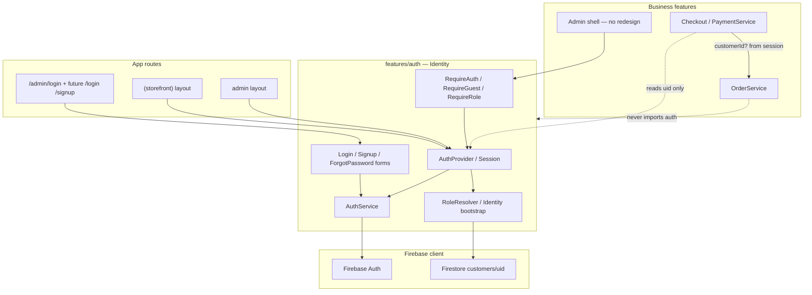

# ADR-017 — Identity Foundation (Authentication, Sessions & Roles)

## Status

**Accepted** — implemented (RFC-017).

## Context

Serious Flux already has a **partial** auth surface from RFC-011 (ADR-004):

| Area | Current state |
|------|---------------|
| Feature module | `src/features/auth/` exists |
| Auth method | Firebase Auth email/password **sign-in only** |
| Session | Client `AuthProvider` + `onAuthStateChanged` |
| Guard | Client `RequireAuth` (any signed-in user passes) |
| Scope | Admin tree only (`src/app/admin/layout.tsx`) |
| Storefront | No auth provider, no login/signup |
| Roles | Typed (`customer` \| `admin`) but **never set or enforced** |
| Profile | `CustomerProfile` types + `customers/{uid}` in docs; **no service** |
| Orders | Optional `customerId`; checkout **never sets it** |
| Middleware | None |
| Firebase Admin SDK | Not used |
| Security Rules | Not in repo |

**Effective rule today:** authenticated Firebase user ⇒ admin access. That is unsafe for a multi-role starter kit and blocks storefront identity.

RFC-017 must introduce a reusable Identity foundation without:

- Implementing Customer Profile / My Orders / Wishlist / Addresses / Notifications
- Adding OAuth
- Changing Checkout UX or requiring login to purchase
- Redesigning Admin UI
- Adding Firebase Admin SDK unless absolutely required

## Goals

1. Identity is a **cross-cutting feature** owned by `features/auth`.
2. Support **guest**, **authenticated customer**, **admin**, and future **staff**.
3. Keep **guest checkout** fully functional.
4. Business features consume identity; they never import Firebase Auth.
5. Admin migrates from “any Auth user” toward **role-based** authorization (architecture only; no Admin UI redesign).
6. Prepare optional `customerId` attachment on orders when the buyer is signed in.

## Non-goals (this RFC)

- Customer Profile UI or CRUD beyond minimal identity bootstrap fields
- My Orders, Wishlist, Addresses, Notifications
- OAuth (Google / Apple / Facebook) — **Google delivered in RFC-018**; Apple/Facebook remain deferred
- Permissions matrix / fine-grained RBAC
- Checkout redesign or login-gated purchase
- Firestore Security Rules delivery (document dependency; implement in a hardening RFC)
- Server session cookies / Next.js middleware (recommended follow-up; not required to start)

---

## Architecture review (as-is)

### What already works

- Clean feature boundary: UI → `AuthService` → Firebase Auth (no Firebase in components).
- Admin login + sign-out path exists (`AdminLoginForm`, `useAuth().signOut()`).
- Domain `AuthUser` mapping isolates Firebase `User` shapes.
- Orders already accept optional `customerId` without breaking guests.
- Collection design anticipates `customers/{uid}` 1:1 with Auth.

### Gaps

```
Guest (implicit)     Customer (missing)     Admin (any Auth user)
        │                    │                      │
        └──────── no shared session model ──────────┘
```

1. **No storefront identity** — signup/login/forgot-password absent; `AuthProvider` not mounted on storefront.
2. **No role resolver** — `AuthUser.role` and `CustomerProfile.role` are unused; dual types diverge.
3. **No identity persistence service** — cannot store `role` / `status` after signup.
4. **Client-only admin gate** — no middleware; shell may flash; Firestore writes rely on uncommitted rules.
5. **Checkout does not pass identity** — even if a user were signed in, orders stay guest-shaped.
6. **Staff missing** from role enums.
7. **Naming tension** — RFC wording uses `users/`; project canon is `customers/` + `CustomerProfile`.

### Coupling risks

| Risk | Detail |
|------|--------|
| Admin = Auth | Duplicated assumption in RequireAuth, AuthService comments, ADR-004, README |
| Dual role types | `AuthUserRole` vs `CustomerRole` with no single source of truth |
| Firebase `Timestamp` on domain types | Leaks SDK into types (pre-existing; do not expand in this RFC) |
| AuthProvider scoped to `/admin` | Storefront and Admin cannot share session without remounting or lifting provider |

---

## Decision

### 1. Identity owns authentication

Expand and complete `src/features/auth/` as the Identity feature. Do **not** move auth into `admin/`, `storefront/`, or `shared/`.

```
features/auth/
  components/     LoginForm, SignupForm, ForgotPasswordForm, guards UI
  hooks/          useCurrentUser, useRequireAuth, useRequireRole, useRequireGuest
  providers/      AuthProvider (session), optional thin SessionProvider alias
  services/       AuthService (+ signup / reset), RoleResolver (or IdentityService)
  types/          AuthUser, AppRole, session types
  lib/            mapAuthUser, role helpers
  guards/         RequireAuth, RequireGuest, RequireRole
  index.ts
```

**Principle:** Identity authenticates and resolves role. Business features receive `AuthUser | null` (and optional `uid` / `role`). They never call Firebase Auth.

### 2. Canonical identity document (Firestore)

**Keep collection name `customers`** (already documented and typed). Do **not** introduce a parallel `users/` collection — that would duplicate the 1:1 Auth uid model and confuse the kit.

RFC-017 persists a **minimal identity bootstrap** document (not a full Customer Profile product):

**Path:** `customers/{uid}`

| Field | Type | Required | Notes |
|-------|------|----------|--------|
| `id` | `string` | yes | Same as Firebase Auth `uid` |
| `email` | `string` | yes | From Auth |
| `displayName` | `string` | yes | From signup / Auth |
| `photoURL` | `string` | no | Align naming with Auth; map from existing `photoUrl` or normalize to one field |
| `role` | `AppRole` | yes | See roles below |
| `status` | `UserStatus` | yes | `active` \| `inactive` (enforcement policy in Open Questions) |
| `createdAt` | Timestamp | yes | |
| `updatedAt` | Timestamp | yes | |

**Out of scope for writes in this RFC:** `addresses`, phone book UX, wishlist, notifications. Existing `CustomerProfile.addresses` may remain on the type as `[]` default for forward compatibility, but Address features are not implemented.

**Do not rename** the collection to `users`. Identity’s domain type may be called `AuthUser` / `IdentityUser`; Firestore remains `customers`.

### 3. Role model

```ts
type AppRole = "guest" | "customer" | "staff" | "admin";
```

| Role | Persistence | Meaning |
|------|-------------|---------|
| `guest` | **Not** stored in Firestore | Unauthenticated session |
| `customer` | Default on signup | Storefront account |
| `staff` | Assigned manually (ops / seed) | Future ops; no permissions matrix yet |
| `admin` | Assigned manually (ops / seed) | Admin dashboard access |

Unify `AuthUserRole` and `CustomerRole` into **`AppRole`** (or keep `CustomerRole` as alias deprecated). Single source of truth for role strings.

### 4. Authentication methods

Firebase Authentication, **email + password only**:

| Capability | RFC-017 |
|------------|---------|
| Sign in | Yes (exists; reuse) |
| Sign up | Yes (new) |
| Forgot / reset password | Yes (new) |
| Sign out | Yes (exists) |
| Google / Apple / Facebook | **No** |

### 5. Unified session model

```
Firebase Auth (client)
        ↓
   AuthService.onAuthStateChanged
        ↓
   AuthUser (uid, email, displayName, …)
        ↓
   RoleResolver.load(uid)  →  customers/{uid}.role + status
        ↓
   Session = { user: AuthUser | null, role: AppRole, status?, loading }
        ↓
   Application (guards, checkout customerId, admin shell)
```

- **Guest session:** `user === null`, `role === "guest"`.
- **Authenticated session:** Firebase user + Firestore role (default `customer` if document missing — see Open Questions).
- **Admin / staff:** same session pipeline; guards check role.

Every feature consumes the same hooks (`useCurrentUser`, `useAuth` / session). Admin stops treating “signed in” as “authorized”.

### 6. Route protection (reusable guards)

| Guard | Behavior |
|-------|----------|
| `RequireAuth` | Must be signed in; configurable `redirectTo` |
| `RequireGuest` | Must be signed out (login/signup pages) |
| `RequireRole` | Must be signed in **and** role ∈ allowed set |

Admin dashboard consumes `RequireRole({ roles: ["admin"] })` (optionally include `staff` later). Do not duplicate checks in AdminHeader / pages.

**Still client-side in this RFC** (matches current architecture; avoids Admin SDK). Document that production hardening = Security Rules + optional middleware/session cookies in a follow-up ADR.

### 7. Guest checkout + authenticated attachment

No Checkout redesign. No login required.

```
CheckoutForm
    → PaymentService.checkout(input)
        → OrderService.create({ …, customerId?: string })
```

| Buyer | `customerId` |
|-------|----------------|
| Guest | omitted |
| Authenticated | `uid` (same as `customers/{uid}`) |

Checkout (or PaymentService orchestration) **reads identity from the session API** (hook / thin adapter), not from Firebase Auth. `OrderService` never imports auth.

### 8. Service boundary

```
features/checkout ──► features/payments ──► features/orders
                              │
                              └── customerId?: string  (from Identity session)
features/auth  ◄── session / role only
features/customers  ◄── profile product (deferred; types may stay)
```

- **Identity** may create/update the **minimal** `customers/{uid}` bootstrap on signup (role, status, email, displayName). That is identity provisioning, not “Customer Profile” product features.
- Full profile editing, addresses, etc. stay deferred under `features/customers`.

### 9. Admin migration (architecture only)

| Before (RFC-011) | After (RFC-017) |
|------------------|-----------------|
| Any Auth user → admin | `RequireRole(["admin"])` (and optionally staff later) |
| `AuthProvider` admin-only | Shared session; Admin layout still wraps provider **or** provider lifts higher |
| `AdminLoginForm` | Keep; may share fields with storefront `LoginForm` via composition |

No Admin UI redesign. Seed / document how the first admin gets `role: "admin"` (Console or one-time script — Open Questions).

### 10. Firebase Admin SDK

**Do not add** unless a later RFC requires custom claims sync or server session cookies. Role resolution for RFC-017 uses **client Firestore read** of `customers/{uid}` after Auth resolves, behind Identity services.

---

## Recommended answers to open questions (proposal)

These are **recommendations for approval**, not final until product owner confirms.

| Question | Recommendation | Why |
|----------|----------------|-----|
| Admin via Firestore role, Custom Claims, or both? | **Firestore role now**; **Custom Claims later** (hardening RFC) | Avoids Admin SDK now; Firestore role unblocks app guards; Claims needed for Security Rules later |
| Auto `role=customer` at signup? | **Yes** | Matches storefront accounts; admin/staff never self-elevate |
| Guest orders claimable later? | **Defer** — design for it (email match + claim flow) but do not implement | Out of scope; keep `customerEmail` snapshots |
| Email verification required? | **No for v1** (optional soft prompt later) | Friction kills guest→account conversion; enforce later if abuse appears |
| Inactive users blocked? | **Yes for admin/staff routes**; **soft for storefront** (block sign-in or treat as guest) | Prevents disabled ops accounts; document exact UX |

---

## Target dependency graph



---

## Files to create

| Path | Purpose |
|------|---------|
| `docs/architecture/ADR-017-identity-foundation.md` | This ADR |
| `src/features/auth/types/` — extend | `AppRole`, `UserStatus`, signup/reset credential types, session type |
| `src/features/auth/services/role-resolver.service.ts` (name TBD) | Load/resolve role + status from `customers/{uid}` |
| `src/features/auth/services/identity-bootstrap.service.ts` (or merge into AuthService) | Create minimal customer doc on signup |
| `src/features/auth/hooks/useCurrentUser.ts` | Stable session consumer |
| `src/features/auth/hooks/useRequireAuth.ts` | Imperative/redirect helper if needed |
| `src/features/auth/hooks/useRequireRole.ts` | Role check helper |
| `src/features/auth/guards/RequireAuth.tsx` | Move/refine from `components/` |
| `src/features/auth/guards/RequireGuest.tsx` | Guest-only routes |
| `src/features/auth/guards/RequireRole.tsx` | Role gate for admin |
| `src/features/auth/components/LoginForm.tsx` | Shared email/password login (Admin may wrap) |
| `src/features/auth/components/SignupForm.tsx` | Customer signup |
| `src/features/auth/components/ForgotPasswordForm.tsx` | Password reset request |
| `src/app/(storefront)/login/page.tsx` (or `/account/login`) | Storefront login route |
| `src/app/(storefront)/signup/page.tsx` | Storefront signup route |
| `src/app/(storefront)/forgot-password/page.tsx` | Reset route |

Exact storefront paths are an implementation detail; prefer short `/login`, `/signup`, `/forgot-password` unless product prefers `/account/*`.

## Files to modify

| Path | Change |
|------|--------|
| `src/features/auth/types/auth.ts` | Unify roles (`AppRole`), add status; expand `AuthUser` |
| `src/features/auth/services/auth.service.ts` | Add `signUp`, `sendPasswordReset`; keep Firebase isolation |
| `src/features/auth/providers/AuthProvider.tsx` | Resolve role after Auth; expose session (`user`, `role`, `status`, `loading`) |
| `src/features/auth/components/RequireAuth.tsx` | Move to `guards/` or re-export; stop equating auth with admin |
| `src/features/auth/components/AdminLoginForm.tsx` | Compose shared `LoginForm` or pass `redirectTo=/admin` |
| `src/features/auth/index.ts` | Public API for hooks, guards, types |
| `src/features/customers/types/customer.ts` | Align `role` / `status` / `photoURL` with Identity; keep addresses deferred |
| `src/features/admin/components/AdminDashboardShell/AdminDashboardShell.tsx` | Use `RequireRole(["admin"])` instead of bare `RequireAuth` |
| `src/app/admin/layout.tsx` and/or `src/app/layout.tsx` / storefront layout | Mount shared `AuthProvider` so storefront + admin share session |
| `src/features/checkout/...` / `PaymentService` | Pass `customerId` when session has uid — **no UX redesign** |
| `docs/firestore.md` | Document `status`, `staff` role, identity bootstrap vs full profile |
| `docs/architecture/ADR-004-admin-dashboard.md` | Note superseded auth assumption (link ADR-017) |
| `README.md` | Update “any Auth user = admin” / deferred identity bullets |

## Files explicitly not touched (stop conditions)

- Checkout layout/UX redesign
- My Orders / Wishlist / Addresses / Notifications features
- OAuth providers
- Admin visual redesign
- Firebase Admin SDK (unless approval changes)

---

## Implementation phases (after approval)

1. **Types + RoleResolver + AuthService signup/reset** — no UI yet.
2. **Session provider** — role-aware; mount for storefront + admin.
3. **Guards** — `RequireRole` for admin; keep login route public.
4. **Storefront auth pages** — login / signup / forgot-password.
5. **Checkout attachment** — optional `customerId` from session only.
6. **Docs + seed guidance** for first admin document.

---

## Risks

| Risk | Mitigation |
|------|------------|
| Client-only role checks remain spoofable | Document; prioritize Security Rules + Claims in hardening RFC |
| Missing `customers/{uid}` for legacy Auth-only admins | Bootstrap on first login or seed script; fail closed for admin if role ≠ admin |
| Lifting `AuthProvider` to root causes storefront SSR/client mismatch | Keep provider client-only; avoid blocking whole tree; use loading gates in guards |
| Signup creates “profile” scope creep | Strict minimal fields; no addresses UI; customers feature owns profile later |
| Dual naming `photoUrl` vs `photoURL` | Normalize in ADR approval; one field name in Firestore |
| Guest order claiming expectations | Explicitly defer; do not promise claim in this RFC |
| Staff without permissions | Role exists for future; `RequireRole` allow-lists only what product needs now |

---

## Open questions (need explicit approval)

1. **Admin identification:** Firestore role only now, or both Firestore + Custom Claims in the same RFC?
2. **Signup default role:** Always `customer`? (Recommended: yes.)
3. **Guest order claiming:** Defer entirely, or reserve a `claimToken` / email-match design stub?
4. **Email verification:** Required before browse/checkout benefits, soft prompt, or ignore for v1?
5. **Inactive status:** Block sign-in entirely, or allow sign-in but deny privileged routes?
6. **First admin bootstrap:** Firebase Console manual field, documented seed script, or temporary env allowlist email (discouraged)?
7. **Provider placement:** Root `app/layout.tsx` vs duplicate providers on storefront + admin (shared module, two mounts)?
8. **Storefront route paths:** `/login` vs `/account/login`?
9. **Field naming:** Keep existing `photoUrl` or align to Auth’s `photoURL`?
10. **Missing role document:** If Auth user has no `customers/{uid}`, treat as `customer` (fail open for storefront) or signed-out / error (fail closed)?

---

## Consequences

### Positive

- One Identity pipeline for guest, customer, staff, admin.
- Guest checkout preserved; authenticated orders can attach `customerId` without UX change.
- Admin moves toward real authorization without UI redesign.
- Clear boundary: Auth ≠ Orders ≠ Customers (profile product).

### Negative / follow-ups

- True security still depends on a **Firestore Security Rules** (+ preferably Claims/middleware) RFC.
- Minimal identity bootstrap will later merge into fuller Customer Profile — must keep fields compatible.
- Staff role without permissions may confuse until a permissions ADR exists.

---

## Approval checklist

Approved decisions (implemented):

- [x] Firestore `customers/{uid}` (not `users/`) as canonical identity doc
- [x] Role set: `guest` \| `customer` \| `staff` \| `admin`
- [x] Firestore role now; Custom Claims deferred
- [x] Signup defaults to `role: customer` / `status: active`
- [x] First admin seeded manually — never via app signup
- [x] Email verification optional
- [x] Inactive admin/staff denied Admin access
- [x] Field name `photoURL`
- [x] Missing doc: bootstrap as customer; admin privileges fail closed
- [x] One global `AuthProvider` at application root
- [x] Storefront login route: `/login`
- [x] Checkout silently attaches `customerId` when authenticated
