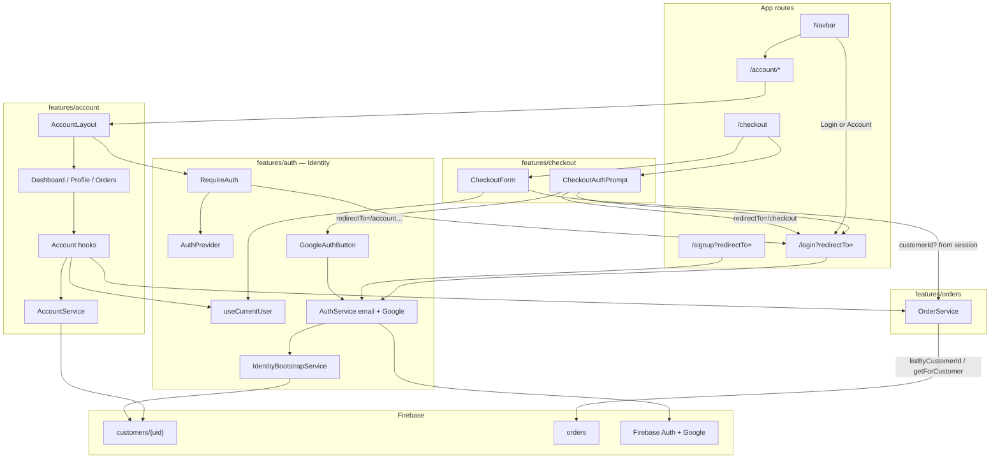

# ADR-018 — Customer Account

## Status

**Accepted** — implemented (RFC-018).

**RFC:** RFC-018  
**Depends on:** ADR-017 (Identity Foundation), ADR-011 (Order Management), ADR-010 (Checkout), ADR-003 (Storefront Design), Firestore model (`docs/firestore.md`)  
**Enables:** future Wishlist / Addresses / Notifications RFCs (nav shell only; not implemented here)

### Additional approved scope (Identity-adjacent) — implemented

1. **Google Authentication** (Firebase `GoogleAuthProvider`) — same session pipeline as email/password
2. **Checkout login prompt** — optional sign-in / Google at top of Checkout; guest checkout unchanged
3. **`redirectTo` query param** — login / signup / Google honor return URL (e.g. `/checkout`, `/account`)

These extend `features/auth` narrowly. They do **not** redesign the session model, role resolver, or AuthProvider.

---

## Context

RFC-017 shipped Identity: storefront login/signup, shared `AuthProvider`, `customers/{uid}` bootstrap, role resolution, and optional `customerId` on authenticated checkout.

ADR-017 deferred OAuth. Firebase Console already has Google Sign-In enabled; RFC-018 adds the client provider so Account + Checkout can use one-click auth without a follow-up Identity RFC.

What still does **not** exist:

| Area | Current state |
|------|---------------|
| Account UI | Navbar shows “Account coming soon” |
| Profile CRUD | `IdentityBootstrapService` create/read only — no profile update |
| Customer orders | `OrderService` has `listAll` / `getById` — no `listByCustomerId` |
| Account routes | No `/account/*` |
| Ownership checks | `getById` returns any order; no `customerId` gate |
| Google Auth | Console enabled; app has email/password only |
| Checkout auth prompt | None — guest form only (already attaches `customerId` if session exists) |
| `redirectTo` on login pages | `LoginForm` accepts prop; pages do not read `?redirectTo=` |

RFC-018 delivers Customer Account plus the Identity-adjacent items above, without Wishlist, Addresses, Notifications, Reviews, Coupons, Loyalty, payment-method management, account deletion, admin customer management, or forcing login to purchase.

---

## Goals

1. Customer Account is its own feature: `features/account/`.
2. Auth provides identity; Account consumes it — never the reverse.
3. Authenticated customers can: dashboard, view/edit basic profile, list own orders, view own order detail, logout.
4. Guests hitting `/account/*` redirect to `/login` (with `redirectTo` back to Account).
5. Order reads for customers always verify ownership (`order.customerId === current customerId`).
6. Reuse `OrderService`, shared UI, storefront chrome, and Identity hooks/guards.
7. **Google Sign-In / Sign-Up / Continue with Google** via Firebase, same session + bootstrap as email/password.
8. **Optional Checkout auth** — prompt to sign in or continue as guest; single checkout path.
9. **`redirectTo`** honored by email and Google flows.

## Non-goals (stop conditions)

- Wishlist, Addresses, Notifications, Reviews, Coupons, Loyalty/Points
- Payment method management
- Account deletion
- Admin customer management
- **Requiring** login before purchase / payment
- Duplicating checkout flows (one `CheckoutView` / `CheckoutForm` only)
- Changing guest checkout rules (email still required; `customerId` omitted when guest)
- Broader OAuth (Apple, Facebook, etc.) — **Google only**
- Auth session / role architecture redesign (only additive Google + redirect helpers)
- Analytics / charts on dashboard
- Guest order claiming by email

---

## Architecture review (as-is)

### What already works (reuse)

| Asset | Location | Reuse for RFC-018 |
|-------|----------|-------------------|
| Session + `customerId` | `useCurrentUser`, `AuthProvider` | Account + Checkout bind to `customerId` |
| Auth guards | `RequireAuth`, `useRequireAuth` | Gate `/account/*` → `/login?redirectTo=…` |
| Logout | `useAuth().signOut()` | Account sidebar action |
| Identity bootstrap | `IdentityBootstrapService.ensureCustomer` | Email **and** Google first login |
| Domain type | `CustomerProfile` in `features/customers/types` | Profile read/write shape |
| Orders domain | `OrderService`, `Order` types, status helpers | Extend service; never fork Admin |
| Order badges | `OrderStatusBadge`, `PaymentStatusBadge` | Customer order list/detail (read-only) |
| Checkout `customerId` | `CheckoutForm` + `useCurrentUser` | Already attaches when authenticated |
| `LoginForm.redirectTo` | prop exists | Wire from `?redirectTo=` search param |
| Shared UI | `Button`, `Input`, `Card`, `EmptyState`, `LoadingState`, `Badge`, Toast | Forms + states |
| Storefront shell | `(storefront)/layout` → Navbar/Footer | Account + Checkout stay in storefront |
| Firestore index hint | `customerId` + `createdAt` DESC | Required for customer order list |

### Gaps

```
Identity (partial)       Account (missing)           Checkout (partial)
  email/password OK        /account/* UI
  Google ──X──►            profile update
  redirectTo query ──X──►  listByCustomerId
  checkout auth prompt ──X──► ownership gate
```

1. **No Account feature module** — `features/customers` is types-only.
2. **No customer order query / ownership gate** on `OrderService`.
3. **No Google provider** in `AuthService` / UI.
4. **Login pages** do not parse `?redirectTo=`.
5. **Checkout** has no optional auth strip (session already works if user signed in elsewhere).
6. **`Order.notes`** are admin-internal — do not show on customer detail.

### Naming: `account` vs `customers`

| Layer | Owner |
|-------|--------|
| Firestore collection + domain type | `customers` / `CustomerProfile` |
| Product UI + profile CRUD | `features/account` |
| Authentication + Google + bootstrap | `features/auth` |

---

## Decision

### 1. Account owns the customer self-service product

```
features/account/
  components/     AccountLayout, Dashboard, ProfileForm, OrderList, OrderDetail, …
  hooks/          useAccountProfile, useCustomerOrders, …
  services/       AccountService (profile only)
  types/          account view models / form inputs (thin; prefer domain types)
  lib/            mappers, dashboard helpers
  config/         ACCOUNT_NAV_ITEMS
  index.ts
```

**Principle:** Auth authenticates (email, Google). Account presents and updates allowed profile fields. Orders remain owned by `OrderService`.

### 2. Routes

| Route | Auth | Purpose |
|-------|------|---------|
| `/account` | Required | Dashboard |
| `/account/profile` | Required | View + edit basic profile |
| `/account/orders` | Required | Own orders list |
| `/account/orders/[id]` | Required | Own order detail (Firestore **document id**) |
| `/login?redirectTo=` | Guest | Sign in (email + Google) |
| `/signup?redirectTo=` | Guest | Sign up (email + Google) |
| `/checkout` | Optional | Guest or authenticated — **unchanged purchase path** |

Account placement: `src/app/(storefront)/account/` with layout `RequireAuth` → `/login?redirectTo=/account` (or current path).

### 3. Account layout

```
My Account
──────────
Dashboard
Orders
Profile
Logout
```

- Extensible `ACCOUNT_NAV_ITEMS` (Wishlist/Addresses later — not shown in v1).
- Logout → `signOut()` → `/`.

### 4. Dashboard

| Field | Source |
|-------|--------|
| Customer name | Profile `displayName` (fallback email) |
| Member since | Profile `createdAt` |
| Order count | Customer orders query |
| Last order | Newest order summary |
| Recent orders | Last **3** (approved recommendation) |

No analytics / charts. Empty state CTA to catalog.

### 5. Profile

**Editable:** `displayName`, `photoURL`, `phone`  
**Read-only:** `email`  
**Never editable:** `role`, `status`, `addresses`

`AccountService` owns updates; refuses forbidden fields. Bootstrap remains auth-owned create path.

**photoURL v1:** URL text field (upload deferred).  
**Auth sync:** best-effort update Firebase Auth `displayName` / `photoURL` after Firestore success (recommended).  
**Phone:** Firestore only.

### 6. Orders (customer)

```ts
listByCustomerId(customerId: string): Promise<Order[]>
getForCustomer(orderId: string, customerId: string): Promise<Order | null>
```

Ownership mismatch → not found (404). Never reuse Admin mutation UI. Guest orders without `customerId` do not appear.

### 7. Order detail (read-only)

Order number, status, payment, shipping, items, totals. **Do not** show admin `Order.notes`.

### 8. Google Authentication (approved)

Lives in **`features/auth`**, not `account`.

```
AuthService.signInWithGoogle()
  → signInWithPopup(auth, GoogleAuthProvider)   // or redirect if product prefers; popup is one-click
  → mapAuthUser
  → RoleResolver.resolve → IdentityBootstrapService.ensureCustomer (if missing)
  → same AuthenticatedSession as email/password
```

| UI label (context) | Same method |
|--------------------|-------------|
| Continue with Google | Checkout prompt, login |
| Sign in with Google | `/login` |
| Sign up with Google | `/signup` |

**First Google login bootstrap** (identical shape to email/password):

| Field | Value |
|-------|--------|
| `role` | `"customer"` |
| `status` | `"active"` |
| `email` | from Google |
| `displayName` | from Google |
| `photoURL` | from Google |
| `addresses` | `[]` |
| `createdAt` / `updatedAt` | now |

- If `customers/{uid}` **exists** → do not overwrite role/status (idempotent `ensureCustomer` as today).
- **Never** auto-create admin/staff.
- UI never imports Firebase Auth — only `AuthService` / `useAuth().signInWithGoogle()`.
- Account pages and Checkout consume the **same** `AuthProvider` session.

**Account linking edge case:** if Google email already exists as email/password, Firebase may throw `auth/account-exists-with-different-credential`. Map to a clear `AuthError`; do not invent a custom linking flow in this RFC (document as known limitation / follow-up).

### 9. Checkout login prompt (approved)

**Guest checkout remains fully supported.** Email remains required for guests. Login is **not** required before payment.

At the **top** of Checkout (above the existing form), when the user is a **guest**, show a small section:

```
Already have an account?

[ Continue with Google ]
[ Sign in ]

or continue as guest
```

| Action | Behavior |
|--------|----------|
| Continue with Google | `signInWithGoogle()` in place (or via `/login?redirectTo=/checkout`); stay/return on `/checkout` |
| Sign in | Navigate to `/login?redirectTo=/checkout` (signup link may pass same param) |
| Continue as guest | No action — existing form remains |

When **already authenticated**, hide the prompt (optional short “Signed in as …” is fine; not required).

**Order attachment (already designed; reaffirm):**

| Buyer | `customerId` passed to `OrderService` |
|-------|----------------------------------------|
| Authenticated before place order | `current customerId` |
| Guest | omitted / `undefined` |

**No other Checkout logic changes.** One `CheckoutView` / `CheckoutForm`. No duplicate checkout routes.

Implementation sketch: `CheckoutAuthPrompt` component in `features/checkout` (or thin auth UI re-export) that uses `useCurrentUser` + `useAuth` — Checkout still does not import Firebase.

### 10. Login redirect (`redirectTo`) (approved)

Canonical query param: **`redirectTo`**.

Examples:

- `/login?redirectTo=/checkout`
- `/signup?redirectTo=/checkout`
- `/login?redirectTo=/account`
- Account guard: `/login?redirectTo=/account/orders`

Rules:

1. Pages read `searchParams.redirectTo` (or client `useSearchParams`).
2. Allowlist relative paths only (must start with `/`, reject `//`, `http:`, open redirects).
3. Default when missing: `/` for login/signup; Account gate should always set `/account` (or deep path).
4. Pass into `LoginForm` / `SignupForm` as `redirectTo`.
5. **Google Sign-In must honor the same `redirectTo`** after success.
6. `RequireGuest` should redirect authenticated users to `redirectTo` when present (else `/`), so returning to checkout after Google works even if session resolves mid-page.

Checkout-started auth → return to **`/checkout`**, not `/account`.

### 11. Navbar (approved)

| Session | Control |
|---------|---------|
| Guest | **Login** → `/login` |
| Authenticated | **Account** → `/account` |

Remove “Account coming soon”. Google remains one click on login/checkout (not a second Navbar control).

### 12. UI system

Continue `shared/ui` + storefront tokens. Shared `GoogleAuthButton` (or similar) in `features/auth/components` reused by Login, Signup, Checkout prompt.

### 13. Authorization model

```
UI / route param
      ↓
customerId from useCurrentUser()
      ↓
OrderService.getForCustomer(id, customerId)
AccountService.updateProfile(customerId, patch)
```

Never trust route params alone. Security Rules remain a follow-up RFC.

---

## Recommended / approved answers to open questions

| # | Question | Status | Answer |
|---|----------|--------|--------|
| 1 | Sync Auth `displayName`/`photoURL` on profile edit? | Recommended | **Yes**, best-effort after Firestore |
| 2 | Phone only in Firestore? | Recommended | **Yes** |
| 3 | Order detail by doc id or `orderNumber`? | Recommended | **Doc id** in URL; display `orderNumber` |
| 4 | Extensible sidebar for future modules? | Recommended | **Yes** (config only; no Wishlist/Addresses UI) |
| 5 | Dashboard recent orders? | Recommended | **Summary + last 3** |
| 6 | Show `Order.notes`? | Recommended | **No** |
| 7 | Avatar: URL vs upload? | Recommended | **URL field** v1 |
| 8 | Post-login `redirectTo`? | **Approved** | **Yes** — Account, Checkout, Google |
| 9 | Google Auth in this RFC? | **Approved** | **Yes** — same session + bootstrap |
| 10 | Checkout optional login prompt? | **Approved** | **Yes** — guest path unchanged |
| 11 | Require login to purchase? | **Approved stop** | **No** |

Items 1–7 still need a final checkmark on the approval checklist if not yet locked.

---

## Target dependency graph



**Allowed imports**

- `account` → `auth` (hooks/guards/signOut), `orders`, `customers` types, `shared/ui`
- `checkout` → `auth` (hooks + Google button / sign-in), `orders` / payments as today — **not** `account`
- `orders` → must not import `account` or `auth`
- `auth` → must not import `account` or `checkout`

---

## Files to create

| Path | Purpose |
|------|---------|
| `docs/architecture/ADR-018-customer-account.md` | This ADR |
| `src/features/account/**` | Layout, dashboard, profile, orders UI, AccountService, hooks, nav config |
| `src/app/(storefront)/account/**` | Account routes + guarded layout |
| `src/features/auth/components/GoogleAuthButton.tsx` (name TBD) | One-click Google CTA |
| `src/features/auth/lib/safe-redirect.ts` (or similar) | Allowlist / sanitize `redirectTo` |
| `src/features/checkout/components/CheckoutAuthPrompt/` | Optional auth strip on Checkout |

## Files to modify

| Path | Change |
|------|--------|
| `src/features/orders/services/order.service.ts` | `listByCustomerId`, `getForCustomer` |
| `src/features/auth/services/auth.service.ts` | `signInWithGoogle`; optional `updateProfileFields` |
| `src/features/auth/providers/AuthProvider.tsx` | Expose `signInWithGoogle` |
| `src/features/auth/components/LoginForm.tsx` | Google button + honor `redirectTo` |
| `src/features/auth/components/SignupForm.tsx` | Google button + honor `redirectTo` |
| `src/app/(storefront)/login/page.tsx` | Read `redirectTo` search param |
| `src/app/(storefront)/signup/page.tsx` | Read `redirectTo` search param |
| `src/features/auth/guards` / hooks | Account → `/login?redirectTo=…`; RequireGuest respects `redirectTo` |
| `src/features/checkout/components/CheckoutView/CheckoutView.tsx` | Mount `CheckoutAuthPrompt` above form |
| `src/features/storefront/components/Navbar/Navbar.tsx` | Login vs Account |
| `src/features/auth/services/identity-bootstrap.service.ts` | Ensure Google fields map; optional `phone` on read |
| `src/features/auth/services/auth-error.ts` | Map Google / account-exists codes |
| `src/features/auth/index.ts` | Export Google button / helpers |
| `docs/firestore.md` | Account updates; Google bootstrap identical; customer order index |
| `docs/architecture/ADR-017-identity-foundation.md` | Note: Google OAuth delivered in RFC-018 (supersedes “OAuth deferred”) |
| `README.md` | `/account`, Google sign-in, checkout optional auth |

## Files explicitly not touched

- Guest checkout rules / payment provider flow redesign
- Duplicate checkout implementations
- Admin orders / admin customers
- Wishlist, Addresses, Notifications, Reviews, Coupons, Loyalty
- Apple / Facebook OAuth
- Firebase Admin SDK / Security Rules delivery

---

## Implementation phases (after final go-ahead)

1. **Open questions 1–7 locked** + this ADR approved.
2. **Identity:** `signInWithGoogle` + bootstrap + `safeRedirect` + login/signup/`redirectTo`.
3. **CheckoutAuthPrompt** — guest-only strip; no form logic changes.
4. **OrderService** — customer list + ownership get.
5. **AccountService** + Account layout/routes.
6. **Dashboard / Profile / Orders UI.**
7. **Navbar** Login ↔ Account.
8. **Docs** — firestore.md, ADR-017 note, README.

---

## Risks

| Risk | Mitigation |
|------|------------|
| Client-only ownership checks | Document; Security Rules follow-up |
| Missing `customerId`+`createdAt` index | Document + create in Firebase console |
| Open redirect via `redirectTo` | Allowlist relative paths only |
| Popup blockers on Google | Prefer popup; document fallback; clear error |
| Account-exists-with-different-credential | Clear AuthError; linking deferred |
| Guest orders invisible in Account | Expected; no claim in this RFC |
| Checkout prompt mistaken for required login | Copy: “or continue as guest”; never block Place order |
| Auth vs Firestore profile drift | Dual-write displayName/photoURL on Account edit |
| Admin notes leak | Never render `Order.notes` on storefront |
| Scope creep into Addresses | Nav config only |

---

## Open questions (need final checkmark)

Still recommended — confirm if not already locked:

1. Profile edit syncs Firebase Auth `displayName` / `photoURL`? → **Yes**
2. Phone only in Firestore? → **Yes**
3. Order detail URL = document id? → **Yes**
4. Extensible account nav config? → **Yes**
5. Dashboard = summary + last 3 orders? → **Yes**
6. Hide `Order.notes` from customers? → **Yes**
7. photoURL = URL field (no upload) v1? → **Yes**

**Already approved in this amendment:**

8. `redirectTo` for Account + Checkout + Google  
9. Google Authentication in RFC-018  
10. Checkout optional auth prompt; guest checkout unchanged  

---

## Consequences

### Positive

- Identity supports email + Google without a later OAuth RFC.
- Checkout can attach `customerId` with one click without forcing accounts.
- Account, Login, and Checkout share one session pipeline.
- Clear boundaries: Identity ≠ Account ≠ Orders.

### Negative / follow-ups

- Guest order claiming still deferred.
- Security Rules still required for real enforcement.
- Account-exists linking across providers deferred.
- ADR-017’s “OAuth deferred” is partially superseded (Google only).

---

## Approval checklist

Approved and implemented:

- [x] Feature lives in `features/account/` (not inside `auth/`)
- [x] Routes: `/account`, `/account/profile`, `/account/orders`, `/account/orders/[id]`
- [x] `RequireAuth` → `/login?redirectTo=…`
- [x] Profile fields: `displayName`, `photoURL`, `phone` only; email read-only
- [x] `OrderService` customer-scoped list + ownership-checked get
- [x] Google Auth via `AuthService`; same bootstrap as email/password; never auto-admin
- [x] Checkout auth prompt optional; guest checkout unchanged; single checkout path
- [x] `redirectTo` honored by email + Google (Checkout → `/checkout`, Account → `/account…`)
- [x] Navbar: Login (guest) / Account (authenticated)
- [x] Stop conditions: no Wishlist/Addresses/etc.; no required login to purchase
- [x] Open questions 1–7 confirmed (Auth sync yes; phone Firestore-only; doc id URLs; extensible nav; dashboard + last 3; hide notes; URL avatar field)
