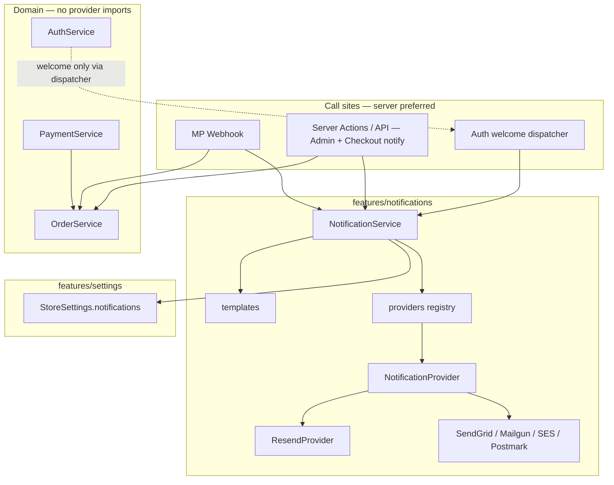

# ADR-019 — Notification System

## Status

**Accepted** — implemented (RFC-019).

**RFC:** RFC-019  
**Depends on:** ADR-010 (Checkout), ADR-011 (Orders), ADR-016 (Mercado Pago), ADR-017 (Identity), ADR-018 (Customer Account), Store Settings (`features/settings`), payment provider abstraction (`features/payments`)  
**Enables:** Transactional email for commerce + account lifecycle; future Stripe/PayPal/other email providers behind the same interface

### Approved adjustments (locked)

1. **Provider architecture** — keep exactly as proposed (`NotificationService` → `NotificationProvider` → concrete providers).
2. **Server API routes for external integrations (project-wide rule)** — Payments, Notifications, and future Inventory / Analytics / etc. must execute through **server API routes**, not directly from business domain services or client components. Clients may trigger routes; domain services stay persistence-only.
3. **NotificationService never owns business persistence** — it only reacts **after** successful operations (`OrderService` / Auth already succeeded).
4. **OrderService** remains responsible **only** for order persistence (no email imports).
5. **Default provider:** Resend.
6. **Welcome emails** are configurable via Store Settings (`enableWelcomeEmail`).
7. **Delivery:** fire-and-forget — failures are logged and never affect business operations.
8. **Future event-driven architecture** is documented below as guidance for later RFCs — **no event bus in RFC-019**.

### RFC-019.1 — Simplify Notifications UX (Resend First)

**Accepted.** Product experience: “the store supports email,” not “choose among five vendors.”

| Keep (architecture) | Hide from Admin UI |
|---------------------|--------------------|
| `NotificationProvider`, registry, ResendProvider, `NotificationService`, templates, dispatch API | Provider selector, SendGrid/SES/Mailgun/Postmark options, reply-to / admin-email infra fields |

Admin configures only: **Sender name**, **Sender email**, **Enable customer emails**, **Enable admin emails**, **Enable welcome email**. Infrastructure (`RESEND_API_KEY`) stays developer-owned. Additional providers remain possible later without changing business features — do not add them to Admin unless a client needs them.

---

## Context

The template already ships Products, Categories, Orders, Checkout, Payments (Mercado Pago + cash on delivery), Customer Accounts, Authentication, and Store Settings.

What does **not** exist:

| Area | Current state |
|------|---------------|
| Transactional email | None — confirmation copy only hints “check your email” |
| Email / notification feature module | Missing |
| Provider abstraction for messaging | Missing (payments already have one) |
| Notification fields on Store Settings | Missing — only public `email` (support contact) |
| Server-side hooks after order lifecycle | Only Mercado Pago webhook is reliably server-side |
| Custom branded password-reset mail | Firebase Auth `sendPasswordResetEmail` owns delivery |

ADR-011 explicitly deferred emails. ADR-018 deferred Notifications. This ADR designs the missing channel without coupling Checkout, Orders, or Account to Resend / SendGrid / Mailgun / SES / Postmark.

---

## Goals

1. Provider-agnostic notification architecture that mirrors `PaymentProvider`.
2. Business features never import concrete email SDKs or provider folders.
3. Email failure never rolls back order, payment, or auth success.
4. Templates are reusable and not hardcoded inside services.
5. Notification-related store config lives with Store Settings (public fields only; secrets in env).
6. Fit Clean Architecture and the existing `features/*` layout.
7. Ship only transactional email for the events approved in RFC-019.

## Non-goals (stop conditions)

- SMS, push, WhatsApp
- Marketing campaigns, newsletters, digests
- Queues, cron jobs, retry workers, dead-letter stores
- Email analytics, open/click tracking
- Attachments, invoices, PDF generation
- In-app notification center / bell UI (Account nav shell mentions “Notifications” as future product UX — not this RFC)
- Replacing Firebase Auth password-reset delivery with a custom provider
- Migrating all Checkout / Admin Firestore writes to the server (noted as follow-up; not a blocker for the abstraction)

---

## Architecture review (as-is)

### What already works (reuse)

| Asset | Location | Reuse for RFC-019 |
|-------|----------|-------------------|
| Provider registry pattern | `features/payments/providers` + `PaymentProvider` | Mirror for `NotificationProvider` |
| Orchestration facade | `PaymentService` | Model `NotificationService` the same way |
| Order domain | `OrderService`, `Order` types, status helpers | Event payloads; never fork Admin |
| Payment webhook (server) | `app/api/webhooks/mercadopago` → `processMercadoPagoWebhook` | Primary reliable trigger for payment emails |
| Payment / fulfillment status | `Order.payment.status`, `Order.status` | Map to notification events |
| Store identity | `StoreSettings` (`storeName`, `email`, `logo`, locale, currency) | Branding + fallbacks in templates |
| Payment public config pattern | `paymentProviders` on `settings/general` | Nested `notifications` public config |
| Secrets-in-env convention | Mercado Pago tokens / webhook secret | Email API keys stay in env |
| Auth signup / Google | `AuthService.signUp` / `signInWithGoogle` | Optional Welcome trigger (server-gated) |
| Password reset UX | `ForgotPasswordForm` + `AuthService.resetPassword` | Keep Firebase Auth email — do not route through NotificationService |
| Admin order mutations | `AdminOrderDetail` → `OrderService.updateStatus` / `updatePaymentStatus` | Need server-safe notify path (see Risks) |
| Checkout create path | `CheckoutForm` → `PaymentService.checkout` (client) | Need server-safe notify path for `order.created` |

### Gaps

```
Checkout / Admin (client Firestore)     Notifications (missing)      Providers (missing)
  order create ──X──►                      NotificationService
  status / payment update ──X──►           templates
  webhook paid ── (server OK) ──X──►       Resend | SendGrid | …
  signup ──X──►                            StoreSettings.notifications
```

1. **No `features/notifications` module.**
2. **No provider interface / registry** for outbound messaging.
3. **No templates layer** — only UI Toast (unrelated; in-app UX only).
4. **Store Settings** has public support `email`, not sender / enable flags / provider slot.
5. **Most commerce writes run in the browser** — email SDKs with API keys cannot run there.
6. **Password reset is Firebase-owned** — custom provider branding for reset is a different project.

### Naming: notifications vs email vs account “Notifications”

| Layer | Owner |
|-------|--------|
| Transactional outbound messages (email v1) | `features/notifications` |
| Concrete transport (Resend, …) | `features/notifications/providers/*` |
| In-app Account “Notifications” product | Deferred — not RFC-019 |
| UI Toast | `shared/ui/Toast` — never conflate |

---

## Decision

### 1. Notifications own outbound transactional messaging

```
features/notifications/
  components/     Optional admin preview / settings widgets only (thin; prefer admin/settings)
  providers/      Registry + concrete providers (Resend first, others later)
  services/       NotificationService (+ NotificationError)
  templates/      Event → subject + html + text (no provider imports)
  types/          NotificationProvider, events, payloads, results
  lib/            Resolve settings, render helpers, safe fire-and-forget
  index.ts        Public API: service, types, event helpers — NEVER concrete providers
```

**Principle:** Client components and domain services never import Resend (or any provider SDK). They either finish persistence, then call `POST /api/notifications/dispatch`, or a server API route (e.g. Mercado Pago webhook) calls `NotificationService` after a successful write.

### 1b. Project-wide rule — external integrations via server API routes

```
Client / Admin UI / Webhook entry
        ↓
Server API route  (only place that talks to external vendors)
        ↓
Domain service (persistence)  and/or  Integration service (Notifications, Payments, …)
```

| May call external SDKs / secrets | Must not |
|----------------------------------|----------|
| `app/api/**` route handlers | `OrderService`, `AccountService`, client components |
| Integration services invoked **only** from those routes (`NotificationService`, payment preference/webhook helpers) | Feature UI importing `providers/resend` |

RFC-019 applies this to Notifications. Existing client-side `PaymentService.checkout` is a known debt; new payment work should move toward the same API-route boundary.

### 2. Provider architecture (mirrors payments)

```
Server API route (/api/notifications/dispatch or webhook)
        ↓
NotificationService
        ↓
NotificationProvider  (interface)
        ↓
Concrete provider (Resend default | SendGrid | Mailgun | SES | Postmark)
```

| Concern | Owner |
|---------|-------|
| Event selection + template render | `NotificationService` + `templates/` |
| Transport send | `NotificationProvider.send` |
| Registry / resolve active provider | `providers/index.ts` (like `getPaymentProvider`) |
| Enable / public labels | Store Settings `notifications` |
| API keys / secrets | Environment variables only |

Proposed contract (illustrative — finalize at implementation):

```ts
interface NotificationProvider {
  readonly id: NotificationProviderId;

  send(message: NotificationMessage): Promise<NotificationSendResult>;
}

interface NotificationMessage {
  to: string | string[];
  subject: string;
  html: string;
  text: string;
  from: { email: string; name?: string };
  replyTo?: string;
  /** Correlation for logs — never required by provider SDKs */
  tags?: { event: NotificationEvent; orderId?: string };
}
```

Only `NotificationService` may call `getNotificationProvider(...)`. Business features import the service (or shared `notify*` helpers), not providers.

**Default concrete provider:** Resend. Registration steps mirror payments:

1. Implement `NotificationProvider`
2. Register in the Map
3. Enable via Store Settings
4. Set env secrets

Checkout / Orders / Account stay unchanged when swapping providers.

### 3. Events in RFC-019

| Event id | Audience | Trigger source (intended) | In RFC-019? | Notes |
|----------|----------|---------------------------|-------------|-------|
| `order.created` | Customer | After successful order create | **Yes** | “We received your order” |
| `payment.approved` | Customer | Payment → `paid` (webhook / admin) | **Yes** | Distinct from created for online checkout |
| `payment.failed` | Customer | Payment → `failed` | **Yes** | |
| `order.cancelled` | Customer | Fulfillment → `cancelled` | **Yes** | |
| `order.shipped` | Customer | Fulfillment → `shipped` | **Yes** | |
| `admin.order.created` | Admin / ops | After successful order create | **Yes** | To configured admin/support inbox |
| `admin.payment.received` | Admin / ops | Payment → `paid` | **Yes** | |
| `account.welcome` | Customer | After successful signup / first Google bootstrap | **Yes** | Gated by `enableWelcomeEmail` (+ customer emails flag) |
| `auth.password_reset` | Customer | Forgot-password flow | **No** | Remains Firebase Auth email |
| Marketing / newsletter | — | — | **No** | Out of scope |
| `order.processing` / `order.completed` | Customer | Status transitions | **Defer** | Nice-to-have; not required for v1 |

**Why password reset is out of RFC-019**

Firebase Auth already sends reset mail via `sendPasswordResetEmail`. Routing that through Resend requires custom email action handlers + Admin SDK templates — a separate Identity/email RFC. Keep one reset path.

**Why both `order.created` and `payment.approved`**

Checkout creates unpaid orders (`pending_payment`). Online buyers need “order placed” immediately and “payment confirmed” when the webhook (or Admin) marks paid. COD may collapse timing but events stay distinct so templates and toggles remain clear.

### 4. Email templates

**Location:** `features/notifications/templates/`

| Why here | Why not elsewhere |
|----------|-------------------|
| Owned by the notifications feature | Not inside `services/` (keeps send vs content separate) |
| Provider-agnostic render functions | Not inside Checkout / Orders / Account |
| One folder per event or shared layout + per-event bodies | Not in `app/` (not routes) |

Rules:

- Templates return `{ subject, html, text }` from typed payloads + store brand context.
- No HTML string literals inside `NotificationService` or providers.
- Shared layout (header with `storeName` / logo, footer with support email) is allowed.
- Locale: start with Store Settings `language` / `locale` for formatting money and dates; full i18n dictionaries can wait.

### 5. Store Settings

**Decision:** Add a nested public `notifications` object on `settings/general` (same pattern as `paymentProviders`).

Do **not** overload the existing public contact `email` as the SMTP “from” address without an explicit sender field — contact email remains customer-facing support.

Proposed shape (public Firestore only):

```ts
notifications?: {
  /** Active provider slot — secrets remain in env. Default: "resend". */
  provider: "resend" | "sendgrid" | "mailgun" | "ses" | "postmark" | "none";
  senderEmail: string;
  senderName: string;
  replyTo: string;
  /** Defaults to StoreSettings.email when empty */
  adminEmail: string;
  enableCustomerEmails: boolean;
  enableAdminEmails: boolean;
  /** Welcome email after signup / first bootstrap — independent toggle */
  enableWelcomeEmail: boolean;
};
```

| Field | Why |
|-------|-----|
| `provider` | Swap transport without code changes in Checkout/Orders; default `resend` |
| `senderEmail` / `senderName` | From header; must be verified at the provider |
| `replyTo` | Often support inbox ≠ authenticated sending domain |
| `adminEmail` | Ops alerts; fallback `StoreSettings.email` |
| `enableCustomerEmails` / `enableAdminEmails` | Kill switches per audience |
| `enableWelcomeEmail` | Turn welcome mail on/off without disabling other customer emails |

Secrets (examples): `RESEND_API_KEY`, `SENDGRID_API_KEY`, etc. — never in Firestore.

Admin UI for these fields can live under Admin → Store Settings (extend existing form), not a separate notifications product UI.

### 6. Delivery strategy

**Decision for RFC-019: fire-and-forget after successful business commits.**

| Approach | Verdict |
|----------|---------|
| Synchronous, blocking checkout/admin until email ACK | Rejected — hurts UX; couples commerce to provider latency |
| Fire-and-forget (`void` / `waitUntil` / catch+log) after success | **Chosen** |
| Durable queue + workers | Out of scope (explicit) |

**Advantages of fire-and-forget**

- Order / payment / signup success is never delayed by email.
- Matches “email failure must not rollback business operations.”
- Simple enough for a starter kit without infra.

**Tradeoffs**

- No automatic retries (accepted until a later Queue RFC).
- Failures are logs + optional future admin visibility only.
- Caller must not `await` in a way that fails the parent transaction; prefer:

```ts
void notificationService.notify(event).catch((error) => {
  // log NotificationError — never rethrow into checkout/order path
});
```

On serverless (App Hosting / Route Handlers), prefer runtime-supported background continuation when available so the process is not frozen mid-send; still never fail the HTTP/business response because of email.

### 7. Failure strategy

```
Order / payment / auth succeeds
        ↓
NotificationService.notify(...)
        ↓
Provider throws / times out
        ↓
Log NotificationError
        ↓
Business result unchanged (order still exists, payment still paid)
```

Rules:

1. Email errors never throw into `OrderService`, `PaymentService` checkout success, or Auth success paths.
2. Idempotency for webhooks already exists on payment updates — notification dispatch should guard “only notify on actual transition” (e.g. pending → paid once), not on no-op webhook repeats.
3. Missing provider / `provider: "none"` / disabled flags → no-op success (skip), not an exception that alarms checkout.
4. Invalid recipient → log + skip; do not mutate order.

### 8. Integration boundaries (critical)

**Domain purity:** `OrderService` must **not** import `NotificationService`. Persistence stays free of side-channel I/O.

**Who calls NotificationService?**

Only **server API routes** (and shared server helpers used exclusively by those routes):

| Trigger | Caller |
|---------|--------|
| Payment approved / failed | Mercado Pago webhook route → after successful `updatePayment` when status actually changes |
| Admin marks paid / cancelled / shipped | Client updates order via `OrderService`, then fire-and-forget `POST /api/notifications/dispatch` |
| Order created + admin new order | Client after successful `PaymentService.checkout`, then `POST /api/notifications/dispatch` |
| Welcome | Client after successful signup / Google (new session), then dispatch; gated by `enableWelcomeEmail` |

**Server-only secrets:** Provider API keys exist only in env and are read inside provider modules used by the notifications API / webhook path.

---

## Future event-driven architecture (guidance only — not RFC-019)

RFC-019 uses **explicit dispatch** after successful writes. A later RFC may introduce a lightweight domain event layer without changing NotificationService’s provider boundary:

```
OrderService.create succeeds
        ↓
emit OrderCreated { orderId }     ← future (in-process or outbox)
        ↓
NotificationHandler / other handlers
        ↓
NotificationService.notify(...)
```

Suggested future event names (align with RFC-019 notification events):

| Domain event | Typical handlers |
|--------------|------------------|
| `OrderCreated` | Customer + admin order emails; future inventory reserve |
| `PaymentApproved` | Customer + admin payment emails; future analytics |
| `PaymentFailed` | Customer payment-failed email |
| `OrderCancelled` | Customer cancel email; future inventory release |
| `OrderShipped` | Customer shipped email |
| `CustomerRegistered` | Welcome email (when enabled) |

**Out of scope until a dedicated Event / Outbox RFC:** message bus, pub/sub, durable outbox table, workers, cross-service brokers.

RFC-019 remains: API route → `NotificationService` → provider. The table above only guides naming so future RFCs do not invent a second vocabulary.

---

## Dependency graph



**Allowed imports**

- `notifications` → `settings` types/loaders, `orders` **types** (payloads), shared lib — not Admin UI, not Checkout UI
- `checkout` / `admin/orders` / webhook → may call `NotificationService` (or shared `notify*` helpers) only from **server** entrypoints
- `orders` → must **not** import `notifications`
- `payments/providers/*` → must **not** import concrete email providers; webhook may call `NotificationService` after order update
- Concrete `notifications/providers/*` → must **not** be imported outside `notifications` (except registry internal)

---

## Notification event flow

### A. Online checkout (Mercado Pago)

```
Customer places order
  → PaymentService.checkout → OrderService.create (pending_payment)
  → notify order.created + admin.order.created  (fire-and-forget, if enabled)
  → redirect to Checkout Pro

Mercado Pago webhook
  → verify payment → OrderService.updatePayment
  → if transition to paid: notify payment.approved + admin.payment.received
  → if transition to failed: notify payment.failed
```

### B. Admin fulfillment

```
Admin sets status shipped / cancelled (via server wrapper)
  → OrderService.updateStatus
  → notify order.shipped / order.cancelled
```

### C. Welcome

```
signUp / first Google bootstrap succeeds
  → server dispatcher (optional)
  → notify account.welcome
```

### D. Password reset (unchanged)

```
ForgotPasswordForm → AuthService.resetPassword → Firebase Auth email
  ✗ NotificationService not involved
```

---

## Files to create

| Path | Purpose |
|------|---------|
| `docs/architecture/ADR-019-notification-system.md` | This ADR |
| `src/features/notifications/types/*` | Events, provider interface, message / result types |
| `src/features/notifications/services/notification.service.ts` | Facade: settings → template → provider |
| `src/features/notifications/services/notification-error.ts` | Domain error codes |
| `src/features/notifications/providers/index.ts` | Registry + `getNotificationProvider` |
| `src/features/notifications/providers/<first-provider>/` | First concrete provider |
| `src/features/notifications/templates/**` | Per-event subject/html/text + shared layout |
| `src/features/notifications/lib/**` | Fire-and-forget helper, settings resolve, branding context |
| `src/features/notifications/index.ts` | Public exports |
| Server dispatchers (API or Server Actions) | Notify-safe wrappers for Admin (and Checkout create if approved) |

## Files to modify (when implementing)

| Path | Change |
|------|--------|
| `src/features/settings/types/settings.ts` | Add `notifications?` public config |
| `src/features/settings/services/store-settings.service.ts` | Defaults / merge for notifications |
| `src/features/admin/settings/*` | Form fields for notification public config |
| `src/features/payments/providers/mercadopago/mercadopago.webhook.ts` | After real payment transition → notify |
| Admin order mutation path | Route through server wrapper that notifies |
| Checkout create path | Server notify for `order.created` / admin new order (approach TBD — open question) |
| Auth signup path | Optional welcome dispatcher |
| `docs/firestore.md` | Document `notifications` on `settings/general` |
| Env / README | Document provider API keys (no secrets in repo) |

## Files explicitly not touched (RFC-019)

- Concrete SMS / push / WhatsApp providers
- Queue / worker infrastructure
- Firebase Auth password-reset replacement
- Invoice / PDF modules
- Account in-app notification center UI
- Changing Order document schema for email audit trails (deferred)

---

## Risks

| Risk | Mitigation |
|------|------------|
| Client-side Checkout / Admin cannot hold email API keys | Server-only NotificationService; add Server Actions / route handlers for notify-capable flows |
| Coupling OrderService to email | Forbid imports; notify only at orchestration / webhook / server wrappers |
| Webhook retries double-send mail | Notify only when `updatePayment` / status actually transitions |
| Provider outage loses email with no retry | Accept in v1; log clearly; document Queue RFC as follow-up |
| Sender domain not verified at provider | Document setup; fail soft (log) when send rejected |
| PII in logs | Log event + order id + error code — never full addresses / bodies in production logs |
| Confusing UI Toast with email | Naming + docs: Toast ≠ NotificationService |
| Scope creep into marketing | Hard stop list in this ADR |
| Password-reset branding pressure | Explicitly out of scope; keep Firebase |

---

## Open questions

1. **Order-created notify while Checkout is client-side** — (A) introduce a small Server Action / API that creates the order + notifies, (B) notify only from a post-create server endpoint called with `orderId` after client create (authz?), or (C) defer `order.created` until a later “server checkout” RFC and ship payment/admin events first?
2. **First concrete provider** — Resend default for the agency, or leave `provider: "none"` until credentials exist?
3. **Welcome email on Google sign-in** — only when `IdentityBootstrapService` creates a **new** customer doc, or also never for Google (email/password signup only)?
4. **Admin email recipient** — single `adminEmail`, or allow a list later?
5. **COD** — send `payment.approved` when Admin marks paid, and still send `order.created` at checkout?
6. **Template language** — English-only strings v1, or Spanish-first given `locale: es-AR` defaults?
7. **Should Admin order updates move entirely to Server Actions in RFC-019**, or only add a parallel notify endpoint?

---

## Consequences

### Positive

- Same replaceability story as payments: new email vendor = new provider + settings + env.
- Commerce stays correct when email fails.
- Clear home for templates and future channels (SMS later can add providers without moving events).
- Store Settings remains the client-rebrand surface.

### Negative / follow-ups

- Requires server entrypoints the current client Checkout/Admin paths do not fully have.
- No durable retries until a Queue RFC.
- Password-reset branding stays on Firebase until a dedicated Identity email RFC.
- In-app Account notifications remain a separate product RFC.

---

## Final recommendation

1. **Accepted** with adjustments above.
2. Implement `features/notifications` with Resend as default provider.
3. Expose send only via `POST /api/notifications/dispatch` (+ webhook calling the same service path).
4. Wire fire-and-forget client requests after successful Checkout / Admin / Auth operations.
5. Keep `OrderService` persistence-only; document future domain events without building a bus.

---

## Approval checklist

- [x] Provider-agnostic service + registry approved
- [x] Event list for RFC-019 approved (including welcome / excluding password reset)
- [x] Templates location approved
- [x] Store Settings `notifications` shape approved (`enableWelcomeEmail` included)
- [x] Fire-and-forget + no-rollback failure policy approved
- [x] Server API routes for external integrations (project-wide) approved
- [x] Resend chosen as default provider
- [x] Future event-driven architecture documented (no bus in RFC-019)
- [x] Stop conditions acknowledged (no SMS/push/queues/analytics/attachments)