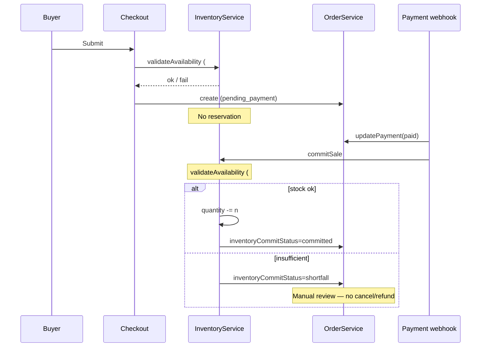

# ADR-023 — Inventory & Stock Management

## Status

**Accepted** — implemented (RFC-023).

**RFC:** RFC-023 (not started)  
**Depends on:** ADR-008 (Admin product CRUD), ADR-009 (Cart), ADR-010 (Checkout), ADR-011 (Orders), ADR-016 (Mercado Pago), ADR-019 (Notifications / server API rule), ADR-020 (Settings section registry), ADR-021 (Admin Design System), Firestore model (`docs/firestore.md`)  
**Enables:** Stock-aware checkout, admin stock ops, storefront availability UX; future variants, warehouses, reservations, movements, purchase orders

### Approved decisions (locked)

1. **Inventory is a top-level feature** — `features/inventory`.
2. **Products own commercial information** (catalog, pricing, media, categories, descriptions, selling policy flags, `sku`).
3. **Inventory owns inventory state and business rules** (quantity, availability, commit/restore).
4. **`InventoryService` is the only place allowed to mutate inventory documents.**
5. **Orders, Checkout, and `ProductService` must never write inventory documents directly.**
6. **Double validation** — availability is validated at Checkout **and** again immediately before `commitSale()`.
7. **No reservations in MVP** — stock is **not** reserved while `pending_payment`. Oversell window is an **accepted limitation**. Future reservations must fit the same public `InventoryService` contract without breaking callers.
8. **Insufficient stock after payment** — do **not** auto-cancel or auto-refund. Mark the order for **manual review** (see §2.6). Payment and order money state remain as paid.
9. **`adjustStock()`** is part of the public `InventoryService` contract (future-ready). RFC-023 does **not** implement Admin adjustment UX beyond absolute set-quantity on the product form; the method exists so later features do not reshape the API.
10. **`inventory/{productId}` is MVP storage only** — warehouse-aware inventory must be achievable later **without** breaking the public `InventoryService` API.
11. **New products default `trackInventory = true`** — inventory can always be disabled per product.
12. **Dashboard** — do **not** introduce a new Inventory Dashboard; **extend** the existing Dashboard with inventory widgets only.
13. **Do not change** Payments, Notifications, Identity, Customers, Orders architecture (status machine / payment model), Checkout architecture, Authentication, or unrelated Firestore collections.
14. **No variants, warehouses, suppliers, purchase orders, reservation TTL, or movement ledger UI in RFC-023.**
15. **No distributed locking in MVP.**
16. **Admin Design System only** — widgets/columns on existing surfaces; no Dashboard redesign.
17. **Trusted side effects** follow ADR-019 (server paths for webhook commit/restore).

### Explicitly out of scope (RFC-023)

- Product variants / per-size / per-color stock
- Multi-warehouse, transfers, suppliers, purchase orders
- Soft reservations with TTL / holds
- Inventory movement ledger / audit UI
- Distributed locks as a hard guarantee
- Changing PaymentProvider, NotificationProvider, Identity, or Customer Admin
- Dedicated Admin “Inventory” nav module
- Auto-cancel / auto-refund on inventory shortfall
- Implementing `adjustStock` Admin flows beyond what product form set-quantity needs (API is documented; full adjustment UX is future)

---

## Context

The starter kit already ships a complete commerce path:

| Area | State today |
|------|-------------|
| Products | Commercial catalog only — no stock fields |
| Cart | Client Zustand; quantity unconstrained |
| Checkout | Creates order via `PaymentService` → `OrderService`; **no stock validation** |
| Orders | Fulfillment + payment lifecycle; comments anticipate stock via `productId` |
| Payments | Mercado Pago + COD; webhook updates `payment.status` |
| Notifications | ADR-019 event table already lists future reserve/release |
| Settings | ADR-020 reserves future section id `"inventory"` |
| Admin | Products CRUD, Dashboard stat cards, Design System |

What does **not** exist:

| Gap | Impact |
|-----|--------|
| No inventory feature / service | Stock rules would leak into ProductService or Checkout |
| No stock on products or inventory collection | Cannot enforce availability |
| No checkout revalidation of quantity | Overselling risk |
| No lifecycle deduct/restore | Cancel/refund cannot restore units |
| No admin stock UX | Ops stuck without Console hacks |
| Doc/code drift | `docs/firestore.md` mentions product `stock`; TypeScript `Product` has none |

ADR-009, ADR-010, and ADR-011 explicitly deferred inventory. ADR-019 already treats Inventory as a future server-integrated domain. This ADR closes that gap with the same architectural quality as Payments, Notifications, Identity, and Customer Management.

---

## Goals

1. Scalable inventory foundation for small businesses **and** multi-client agency reuse.
2. Clear ownership: Products = commercial; Inventory = stock state + availability rules.
3. Double-validated checkout + order-lifecycle stock mutations via one service.
4. Admin stock visibility (list, badges, filters, product form, dashboard widgets).
5. Configurable storefront availability UX without hardcoding client behavior.
6. Leave room for variants, warehouses, reservations, movements, and audit — without implementing them.
7. Resolve the `docs/firestore.md` vs code gap with an explicit model.

## Non-goals (hard stop)

- Building a WMS
- Solving concurrent purchase races with locking or reservations
- Variant SKUs as first-class stock units
- Changing Orders status machine or PaymentProvider contracts
- Redesigning Admin Dashboard or Settings shell
- Automatic financial remediation on shortfall

---

## 1. Architecture review (as-is)

### Mental model (today)

```
ProductService ──► products/{id}     (commercial fields only)
CartStore       ──► local quantities (no max)
CheckoutForm    ──► PaymentService.checkout
                         │
                         ▼
                   OrderService.create  →  pending_payment
                         │
         MP webhook / Admin ──► OrderService.updatePayment / updateStatus
                         │
                   NotificationService (after success) — fire-and-forget
                         │
                   Inventory ── X (missing)
```

### What already works (reuse)

| Asset | Location | Reuse for RFC-023 |
|-------|----------|-------------------|
| Domain service + `*Error` | `ProductService`, `OrderService` | Mirror for `InventoryService` / `InventoryError` |
| Product commercial model | `features/products/types/product.ts` | Extend with **policy** fields only; not mutation API |
| Admin product CRUD | `features/admin/products` | Stock column, form fields, filters |
| Order line `productId` | `OrderItem` | Deduct/restore key (product-level) |
| Order payment lifecycle | `OrderService.updatePayment` | Commit stock when `payment.status → paid` |
| Order cancel path | `OrderService.updateStatus(..., "cancelled")` | Restore when stock was committed |
| Order admin notes | `Order.notes` / `updateNotes` | Optional human-readable shortfall context |
| Checkout orchestration | `PaymentService.checkout` | First validation via Inventory; do not put rules in form |
| Cart quantity UX | `CartView` / `AddToCartButton` | Soft UX limits; server still enforces |
| Admin Design System | `features/admin/ui` | Table, toolbar, badges, `AdminStatCard` |
| Domain badges pattern | Orders / Customers | `StockStatusBadge` |
| Settings section registry | ADR-020 / `SETTINGS_SECTIONS` | Append `"inventory"` |
| Server integration rule | ADR-019 | Inventory mutations from webhooks via trusted server path |
| Event vocabulary | ADR-019 table | Align commit/release with paid/cancelled (MVP); reserve later |
| Firestore docs intent | `docs/firestore.md` | Replace “deferred” + fix `stock` wording |

### Gaps

1. **No `features/inventory`.**
2. **ProductService would become a god service** if stock mutations were added there.
3. **Checkout trusts cart** — no live product/stock re-fetch (ADR-009 already noted this risk for price/stock).
4. **Order create on client** — same Security Rules risk as today; inventory checks are advisory until Rules/API harden.
5. **No idempotency keys** for deduct/restore — needed so webhooks/retries do not double-adjust.
6. **Doc claims product `stock`** but code has no field — ADR chooses collection + policy split.

### Patterns to mirror (and one deliberate difference)

| Pattern | Payments / Notifications | Inventory |
|---------|--------------------------|-----------|
| Top-level feature folder | Yes | Yes |
| Domain service owns writes | Yes | Yes |
| Provider registry | Yes (multi-vendor) | **No for MVP** — single stock strategy |
| Fire-and-forget after success | Notifications | **No** — stock affects commerce correctness |
| Server API for trusted side effects | Yes | Yes for webhook commit/restore |
| Nested Store Settings | `notifications`, `paymentProviders` | Optional `inventory` public defaults |
| Orders stay persistence-focused | OrderService does not send email | OrderService does not write stock docs |

**Critical difference vs Notifications:** email failure must not roll back orders; checkout stock failure **must** block order create. Post-payment shortfall must **not** silently invent refunds — it flags manual review (§2.6).

---

## 2. Decision summary

### 2.1 Inventory is its own top-level feature (approved)

**Decision:** Create `features/inventory`.

| Criterion | Embed in Products | Own feature |
|-----------|-------------------|-------------|
| Single responsibility | ProductService mixes catalog + stock rules | Clear split |
| Future warehouses / movements / POs | Forces ProductService growth | Natural home |
| Checkout / Orders coupling | Temptation to call ProductService.update(stock) | Call InventoryService only |
| Parity with Payments / Notifications / Customers | Weak | Strong |
| Agency reuse | Harder to swap stock strategy per client | Swappable module |

**Products** = commercial catalog + selling policy.  
**Inventory** = stock engine.  
Admin product screens **compose** both (same pattern as Admin customer detail composing Customers + Orders).

**Hard rule:** `InventoryService` is the **only** writer of inventory documents. Orders, Checkout, and `ProductService` never write `inventory/*`.

### 2.2 Physical model: policy on Product, quantity on `inventory` (MVP storage)

**Decision (MVP storage — not forever):**

1. **`products/{productId}`** gains **selling / tracking policy** fields (and commercial identifiers like `sku`).
2. **`inventory/{productId}`** is the **source of truth for quantity** (document id = product id for 1:1 MVP).
3. **`InventoryService` owns all reads/writes of inventory docs.**
4. **`ProductService` may read/write policy fields** (`trackInventory`, thresholds, backorders, visibility) as part of product CRUD — but **must not** mutate quantity.
5. **No denormalized `stockQuantity` on product** in MVP (avoids dual-write drift).

#### Future warehouse support (architecture protection)

`inventory/{productId}` is an **MVP storage model only**.

Callers must depend on **`InventoryService` public methods** (`getByProductId`, `validateAvailability`, `commitSale`, `restoreSale`, `adjustStock`, …), **not** on document path shape.

Future evolution (examples — not implementing now):

- `inventory/{warehouseId}_{productId}` or `warehouses/{id}/stock/{productId}`
- Aggregate “available across warehouses” inside the service
- Variant-level stockable ids behind the same method signatures

**Goal:** protect the **API contract**, not today’s schema. Schema may change; public InventoryService methods should not need breaking renames for warehouse support.

### 2.3 Lifecycle: no reservation on `pending_payment` (approved)

| Moment | Inventory action |
|--------|------------------|
| Cart add / qty change | Soft UX only — **not** authoritative |
| Checkout submit | **Validation #1** — `validateAvailability` (hard fail if blocked) |
| Order created (`pending_payment`) | **No quantity change — no reservation** |
| Immediately before decrease | **Validation #2** — re-check inside / immediately before `commitSale` |
| Payment becomes `paid` | **`commitSale`** (decrease available) if validation #2 passes |
| COD treated as paid at create | Same: validation #2 then `commitSale` |
| Payment `failed` | No stock change |
| Order `cancelled` after successful commit | **`restoreSale`** |
| Payment `refunded` after successful commit | **`restoreSale`** (idempotent with cancel) |
| Cancel before commit | No stock change |
| `commitSale` validation #2 fails | **Manual review** — no auto-cancel / no auto-refund (§2.6) |

**Why no reservation on `pending_payment` (intentional MVP)**

1. Abandoned Mercado Pago checkouts must not lock stock.
2. Reservations need TTL, release rules, and UX — deferred.
3. The oversell window between checkout validation and paid-commit is an **accepted limitation**.
4. Future `reserve` / `releaseReservation` / `commitReservation` must be addable **without breaking** today’s public methods (same service; new methods or optional params later).

```
Checkout ─validate #1──► Order create (pending_payment) ─► [no stock write]
                              │
                    payment → paid
                              │
                    validate #2 ──► commitSale ──► quantity -= n
                              │
                    (if #2 fails) ──► mark manual review (no cancel / no refund)
                              │
              cancelled / refunded (if committed) ─restoreSale──► += n
```

### 2.4 Double validation (approved — mandatory)

Inventory availability **must** be validated **twice**:

| Pass | When | Purpose |
|------|------|---------|
| **#1** | Checkout validation (before `OrderService.create`) | Fail closed for the buyer; avoid creating doomed unpaid orders when stock is already gone |
| **#2** | Immediately before `commitSale()` | Prevent committing against **stale** assumptions after the unpaid window |

Even without reservations, pass #2 is required. Checkout success does **not** authorize a blind decrement at payment time.

`commitSale` must treat pass #2 as authoritative for the mutation decision (including shortfall handling in §2.6).

### 2.5 Orchestration ownership

| Trigger | Caller | Notes |
|---------|--------|-------|
| Validation #1 | Checkout / Payment orchestration **before** `OrderService.create` | Fail closed |
| Validation #2 + commit | Inside / immediately before `commitSale` on paid path | Idempotent |
| Restore on cancel/refund | Admin order mutations + trusted refund path | Idempotent |
| Manual absolute set | Admin Product form → `setQuantity` / `adjustStock` | Not ProductService |

**Orders architecture unchanged:** `OrderService` does not import Firebase inventory paths. Thin orchestration (webhook helpers / Admin handlers) calls `InventoryService` after successful order mutations — same separation as notifications after order success.

### 2.6 Insufficient stock after payment → manual review (approved)

**Scenario:** Customer successfully pays. Before `commitSale`, another purchase consumed remaining inventory. Pass #2 fails.

**Required behavior:**

| Action | Allowed? |
|--------|----------|
| Auto-cancel the order | **No** |
| Auto-refund the payment | **No** |
| Drive inventory quantity negative | **No** |
| Leave payment as paid | **Yes** |
| Mark order for manual review | **Yes** |

**Why manual review is safest**

1. **Money already moved** (or COD commitment exists). Automatic refund invents a financial decision the system cannot judge (partial fulfill? restock incoming? substitute SKU? customer preference?).
2. **Automatic cancel** destroys a paid order without human context and can fight provider refund timing / webhook races.
3. **Ops can choose** the correct remediation: restock and fulfill, contact the customer, partial ship, or refund via existing Admin payment tools.
4. Preserves **Orders architecture** — do not invent a parallel fulfillment state machine for an edge case.

**How to mark for review (domain convention — no new `OrderStatus`)**

Do **not** add a new fulfillment status (would expand ADR-011’s status machine).

Extend the inventory idempotency field already planned on the order:

```ts
inventoryCommitStatus:
  | "none"
  | "committed"
  | "restored"
  | "shortfall"; // paid, commit refused — needs Admin review
```

Optionally append a short internal note via existing `Order.notes` / `updateNotes` for human context (e.g. which SKUs failed). Admin Orders UI should surface `shortfall` clearly (badge or banner) in RFC-023.

`inventoryCommitStatus: "shortfall"` remains idempotent under webhook retry: re-entry must not cancel, refund, or double-flag chaotically.

### 2.7 `adjustStock()` — public contract, future-ready (approved)

`InventoryService` exposes a generic adjustment operation as part of the **public API**:

```ts
adjustStock(input: {
  productId: string;
  delta: number;
  reason?: string;
}): Promise<InventoryRecord>;
```

**RFC-023 does not build** the full adjustments / restocking / PO product. The method is locked into the contract so future features do not force a breaking rename:

- Manual adjustments
- Restocking
- Purchase orders
- Corrections
- Supplier deliveries

MVP Admin product form may use `setQuantity` (absolute) and/or `adjustStock` internally; dedicated adjustment history UI is out of scope.

### 2.8 Defaults: `trackInventory = true` for new products (approved)

**Decision:** Newly created products default to **`trackInventory: true`**.

**Reasoning**

1. A stock-aware starter kit should **opt into inventory by default** so clients do not accidentally oversell on day one.
2. Inventory remains **disable-able per product** (`trackInventory: false`) for digital goods, made-to-order, or clients who do not track stock.
3. Store Settings may still expose `defaultTrackInventory` for agencies that prefer the opposite default; the **recommended kit default** is `true`.
4. **Existing documents** without the field: mapper treats missing as **`false`** for backward compatibility with current always-sellable catalogs (non-breaking read). New creates use `true`.

### 2.9 Dashboard: extend, do not replace (approved)

Inventory does **not** introduce a new Dashboard. It **extends** the existing Admin Dashboard with inventory-related widgets (low stock / out of stock counts) using `AdminStatCard` and the current Overview grid.

### 2.10 No InventoryProvider registry in MVP

Stock is not a third-party vendor problem. A single `InventoryService` is enough.

---

## 3. Feature boundaries

### Responsibilities

#### `features/inventory` owns

- Availability evaluation (`in_stock` / `low_stock` / `out_of_stock` / `not_tracked`)
- Quantity reads and mutations (`setQuantity`, `adjustStock`, `commitSale`, `restoreSale`)
- Validation API used at checkout **and** inside commit
- Idempotency / shortfall marking coordination for order-linked commits
- Future: reservations, movements, warehouses, adjustment UX

#### `features/products` owns

- Name, slug, description, media, price, currency, category, featured, active, order
- Commercial identifiers: `sku` (and future barcode)
- Selling policy flags: `trackInventory`, `allowBackorders`, `visibilityWhenOutOfStock`, `lowStockThreshold`
- Product CRUD / storefront catalog queries
- **Never** writes `inventory/*`

#### `features/checkout` owns

- Form UX and calling **validation #1** before order create
- Mapping cart → order items
- **Must not** contain stock arithmetic or Firestore inventory writes

#### `features/orders` owns

- Order persistence, status, payment fields, notes
- Persisting `inventoryCommitStatus` when Inventory orchestration requests it (narrow field update — **not** stock math)
- **Must not** write inventory docs

#### `features/cart` owns

- Client-side quantities
- Optional soft max from last-known availability
- **Must not** be trusted for enforcement

#### `features/admin` owns

- Presentation: stock column, badges, filters, form fields, dashboard widgets, shortfall surfacing on orders
- Calls ProductService + InventoryService — never Firebase inventory directly

#### `features/settings` owns

- Global **defaults** only (see §12)
- Not per-product overrides

### Public API (approved contract)

```ts
// features/inventory/services/inventory.service.ts

type StockStatus =
  | "not_tracked"
  | "in_stock"
  | "low_stock"
  | "out_of_stock";

type InventoryRecord = {
  productId: string;
  quantity: number;          // available sellable units (MVP storage)
  // reservedQuantity?: number; // future — same record shape can grow
  updatedAt: Timestamp;
  // warehouseId?: string;     // future — storage may move; API stays
};

type AvailabilityInput = {
  productId: string;
  quantity: number;
  trackInventory: boolean;
  allowBackorders: boolean;
};

type AvailabilityResult = {
  productId: string;
  ok: boolean;
  status: StockStatus;
  availableQuantity: number | null; // null when not tracked
  reason?:
    | "product_inactive"
    | "insufficient_stock"
    | "out_of_stock"
    | "inventory_disabled";
};

class InventoryService {
  getByProductId(productId: string): Promise<InventoryRecord | null>;
  getByProductIds(productIds: string[]): Promise<Map<string, InventoryRecord>>;

  /** Admin: set absolute quantity. */
  setQuantity(productId: string, quantity: number): Promise<InventoryRecord>;

  /**
   * Generic relative adjustment (public contract — future-ready).
   * Used later for manual adjustments, restocking, POs, corrections,
   * supplier deliveries. RFC-023 may use it internally; full UX deferred.
   */
  adjustStock(input: {
    productId: string;
    delta: number;
    reason?: string;
  }): Promise<InventoryRecord>;

  getStockStatus(input: {
    trackInventory: boolean;
    quantity: number;
    lowStockThreshold: number;
  }): StockStatus;

  /** Shared by checkout (pass #1) and commitSale (pass #2). */
  validateAvailability(items: AvailabilityInput[]): Promise<AvailabilityResult[]>;

  /**
   * Decrease stock for a paid order.
   * MUST run validation #2 immediately before mutating.
   * Idempotent on orderId.
   * On insufficient stock: do not go negative; signal shortfall
   * (inventoryCommitStatus = "shortfall") — no cancel/refund here.
   */
  commitSale(
    orderId: string,
    items: Array<{ productId: string; quantity: number }>,
  ): Promise<void>;

  /**
   * Restore stock after cancel/refund. Idempotent on orderId.
   * No-op if never committed or already restored.
   * No-op (or no quantity change) if status is shortfall without commit.
   */
  restoreSale(
    orderId: string,
    items: Array<{ productId: string; quantity: number }>,
  ): Promise<void>;
}
```

**Future-compatible methods (document only — do not implement in RFC-023):**

```ts
// reserve(orderId, items, ttl?)
// releaseReservation(orderId)
// commitReservation(orderId)
// listMovements(productId)
// transfer(fromWarehouse, toWarehouse, qty)
```

These must be additive. Existing methods keep their semantics.

### Ownership diagram

```
                 ┌─────────────────────┐
                 │  features/products  │  commercial + selling policy
                 └──────────┬──────────┘
                            │ productId, trackInventory, thresholds, sku
                            ▼
┌──────────────┐   ┌─────────────────────┐   ┌─────────────────┐
│ checkout     │──►│ features/inventory │◄──│ orders (hooks)  │
│ validate #1  │   │ InventoryService    │   │ validate #2 +   │
│ only         │   │ ONLY inventory      │   │ commit / restore│
└──────────────┘   │ document writer     │   │ + shortfall mark│
                   └──────────┬──────────┘   └─────────────────┘
                              │
                   ┌──────────▼──────────┐
                   │ features/admin/*    │  compose Product + Inventory UX
                   └─────────────────────┘
```

---

## 4. Product model extension

### Fields on `Product` (policy + identity)

| Field | Type | Required | Owner | Purpose |
|-------|------|----------|-------|---------|
| `sku` | `string` \| omitted | no | Products | Commercial identifier; snapshot onto `OrderItem.sku` when present |
| `trackInventory` | `boolean` | yes | Products (policy) | **New creates default `true`**; missing on old docs → read as `false` |
| `lowStockThreshold` | `number` | yes when tracked (default from settings) | Products (policy) | Badge / widget threshold |
| `allowBackorders` | `boolean` | yes (default `false`) | Products (policy) | Sell when quantity ≤ 0 |
| `visibilityWhenOutOfStock` | `"visible"` \| `"hidden"` | yes (default `"visible"`) | Products (policy) | Storefront listing/PDP visibility when out |

**Not on Product (MVP):** `stockQuantity`, `barcode`, `weight`, `reservedQuantity`, warehouse ids.

**Reserved for future (comments only on types):**

- Variant ids / option matrices
- `barcode`, `weight`, dimensions
- Per-variant inventory keys

### Fields on `inventory/{productId}` (MVP storage)

| Field | Type | Required | Purpose |
|-------|------|----------|---------|
| `productId` | `string` | yes | Same as doc id (explicit for queries/exports) |
| `quantity` | `number` | yes | Available units |
| `updatedAt` | `Timestamp` | yes | Last mutation |
| `updatedBy` | `string` \| omitted | no | Admin uid for manual sets (optional MVP) |

**Future fields (do not add now):** `reservedQuantity`, `warehouseId`, `reorderPoint`, `supplierId`, `averageCost`.

### Idempotency + shortfall on order

```ts
inventoryCommitStatus:
  | "none"
  | "committed"
  | "restored"
  | "shortfall";
```

Full movement ledger remains future work; this field is enough for MVP idempotency and manual-review signaling without changing `OrderStatus`.

---

## 5. Inventory architecture

### Availability rules (MVP)

| `trackInventory` | `quantity` | `allowBackorders` | Status | Purchasable? |
|------------------|------------|-------------------|--------|--------------|
| false | n/a | n/a | `not_tracked` | Yes |
| true | > threshold | any | `in_stock` | Yes |
| true | > 0 and ≤ threshold | any | `low_stock` | Yes |
| true | ≤ 0 | false | `out_of_stock` | No |
| true | ≤ 0 | true | `out_of_stock` (+ backorder copy) | Yes |

### Checkout validation (pass #1)

Before `OrderService.create`:

1. Load products for cart `productId`s.
2. Reject inactive / missing products.
3. Load inventory for tracked products.
4. `InventoryService.validateAvailability`.
5. Only then create order / start payment.

### Commit validation (pass #2)

Inside the paid path, **immediately before** decreasing quantity:

1. Load current inventory + product policy for line items.
2. `validateAvailability` again (or equivalent atomic check).
3. If ok → decrement + `inventoryCommitStatus = "committed"`.
4. If not ok → **do not** decrement; set `inventoryCommitStatus = "shortfall"`; optional admin note; **do not** cancel or refund.

### Accepted limitation: oversell window

Between pass #1 (checkout) and pass #2 (paid commit), another buyer may consume stock because **nothing is reserved** on `pending_payment`.

| In MVP | Not in MVP |
|--------|------------|
| Double validation | Reservations / soft holds |
| Shortfall → manual review | Auto-cancel / auto-refund |
| Idempotent commit/restore | Distributed locks |
| Future additive `reserve*` APIs | Breaking redesign of InventoryService |

---

## 6. Files to create (RFC-023)

```
docs/architecture/ADR-023-inventory-stock-management.md   # this file

src/features/inventory/
  types/
    inventory.ts
    index.ts
  services/
    inventory.service.ts
    inventory-error.ts
    index.ts
  lib/
    stock-status.ts
    index.ts

src/features/admin/products/
  components/StockStatusBadge.tsx

src/app/api/inventory/              # optional if webhook orchestration needs routes
  commit/route.ts
  restore/route.ts
```

Admin UI stays under `features/admin/products` and `features/admin/dashboard` — **no** new Admin nav item; **no** new Dashboard.

Settings:

```
src/features/settings/types/inventory.ts
src/features/admin/settings/sections/InventorySettingsSection.tsx
```

---

## 7. Files to modify (RFC-023)

| File | Change |
|------|--------|
| `src/features/products/types/product.ts` | Policy + `sku`; new-create default `trackInventory: true` |
| `src/features/products/services/product.service.ts` | Map/persist policy fields; **no** quantity writes |
| `src/features/orders/types/order.ts` | `inventoryCommitStatus` including `shortfall` |
| `src/features/admin/products/ProductForm.tsx` | Policy + qty via InventoryService |
| `src/features/admin/products/AdminProductsTable.tsx` | Stock column, badges, filters |
| `src/features/admin/orders/*` | Surface `shortfall` for manual review |
| `src/features/admin/dashboard/DashboardOverview.tsx` (+ loader) | Inventory widgets on **existing** Dashboard |
| `src/features/checkout/components/CheckoutForm/*` | Validation #1 |
| MP webhook / paid orchestration | `commitSale` (includes validation #2) |
| Admin order cancel / refund handlers | `restoreSale` |
| `src/features/settings/types/settings.ts` | Nested `inventory?` defaults |
| `src/features/admin/settings/config/settings-sections.ts` | Register `"inventory"` |
| Storefront product surfaces | Availability UX |
| `scripts/seed-products.ts` | Policy + inventory docs |
| `docs/firestore.md` | Document model; remove lone `stock` claim |

**Do not modify:** PaymentProvider interface, Notification providers, Identity, Customers domain behavior, Cart persistence model, Order status enum / payment status enum.

---

## 8. Firestore model changes

### `products/{productId}` — additive fields

```json
{
  "sku": "CAM-OXF-BLANCA",
  "trackInventory": true,
  "lowStockThreshold": 5,
  "allowBackorders": false,
  "visibilityWhenOutOfStock": "visible"
}
```

Mapper defaults:

| Case | `trackInventory` |
|------|------------------|
| **New product create** | `true` (approved kit default) |
| **Existing doc missing field** | read as `false` (non-breaking) |
| Other policy defaults | `allowBackorders: false`, `visibilityWhenOutOfStock: "visible"`, threshold from settings or `5` |

### `inventory/{productId}` — new collection (MVP storage)

```json
{
  "productId": "abc123",
  "quantity": 25,
  "updatedAt": "<Timestamp>"
}
```

If `trackInventory` is true but doc missing → treat quantity as `0` (fail closed).

### `orders/{orderId}` — additive field

```json
{
  "inventoryCommitStatus": "none"
}
```

Values: `"none"` | `"committed"` | `"restored"` | `"shortfall"`.

### Indexes (MVP)

Document-id lookups only. Admin filters join in memory at starter-kit scale.

### Security (document for Rules RFC)

- Clients must not write `inventory/*`.
- Only Admin / trusted server may write inventory and `inventoryCommitStatus`.

---

## 9. Inventory lifecycle (detail)

### Online (Mercado Pago)

1. **Validation #1** at checkout.
2. Create order `pending_payment` — **no reservation**.
3. Webhook → payment `paid` → **`commitSale`** (runs **validation #2** then decrement, or marks `shortfall`).
4. Cancel from `pending_payment`: no restore.
5. Cancel from `paid` after `committed`: **`restoreSale`**.
6. Refund after `committed`: **`restoreSale`** (idempotent).
7. `shortfall`: Admin reviews manually; no automatic money movement.

### Cash on delivery

1. Validation #1.
2. When COD path marks paid → `commitSale` (validation #2 + commit or shortfall).
3. Cancel/refund after commit → restore.

### Failed payment

No commit → no restore.

### Admin quantity edits

`setQuantity` / `adjustStock` — independent of order commit status.

### Sequence (MVP)



---

## 10. Admin UX proposal

Keep Admin Design System. Extend Products + **existing** Dashboard + Orders shortfall visibility.

### Products list

| Addition | Detail |
|----------|--------|
| Column | Stock (quantity or “—” if not tracked) |
| Badges | In Stock / Low Stock / Out of Stock / Inventory Disabled |
| Filters | Low stock / Out of stock / Tracked / Not tracked |

### Product detail / form

| Field | Control |
|-------|---------|
| SKU | text |
| Track inventory | switch (default on for new) |
| Stock quantity | number → InventoryService |
| Low stock threshold | number |
| Allow backorders | switch |
| When out of stock | Visible / Hidden |

### Dashboard

**Extend** existing Overview with inventory `AdminStatCard`s (low stock / out of stock).  
**Do not** create a separate Inventory Dashboard or redesign Overview.

### Orders

Surface `inventoryCommitStatus === "shortfall"` for manual review (badge/banner). Ops use existing cancel/refund/notes tools deliberately.

### Nav

No top-level “Inventory” nav in MVP.

---

## 11. Storefront UX proposal

| Situation | UX |
|-----------|----|
| `not_tracked` | Normal Add to Cart |
| `in_stock` | Normal Add to Cart |
| `low_stock` + show remaining | Optional “Only X left” |
| `out_of_stock` + backorders | Add to Cart; backorder copy |
| `out_of_stock` + no backorders | Disable/hide Add to Cart |
| Hidden when out / global hide | Omit from listings |

---

## 12. Store Settings impact

| Setting | Type | Why global |
|---------|------|------------|
| `defaultTrackInventory` | `boolean` | New product form default — **kit recommend `true`** |
| `defaultLowStockThreshold` | `number` | New product default + fallback |
| `defaultAllowBackorders` | `boolean` | New product default |
| `hideOutOfStockProducts` | `boolean` | Catalog-wide listing policy |
| `showRemainingStock` | `boolean` | Storefront “Only X left” |

```ts
inventory?: {
  defaultTrackInventory: boolean; // recommended default: true
  defaultLowStockThreshold: number;
  defaultAllowBackorders: boolean;
  hideOutOfStockProducts: boolean;
  showRemainingStock: boolean;
};
```

---

## 13. Security considerations

1. Clients must not write `inventory/*`.
2. `commitSale` / `restoreSale` from webhooks run in trusted server context (ADR-019).
3. Checkout validation on client is bypassable — pair with validation #2 at commit; Rules/API hardening remains a known deploy risk.
4. Idempotency + `shortfall` prevent webhook replay from corrupting stock or inventing refunds.
5. Only `admin` manages stock; no new role matrix in RFC-023.

---

## 14. Performance considerations

1. Admin list join of products + inventory is acceptable at starter-kit scale.
2. Batch inventory reads on storefront grids; avoid N+1.
3. No new composite indexes required for MVP id lookups.
4. Do not denormalize quantity onto product until measured need.
5. Warehouse redesign later must not force every UI to know storage paths — keep reads behind InventoryService.

---

## 15. Risks

| Risk | Severity | Mitigation |
|------|----------|------------|
| Oversell between validate #1 and #2 | Accepted MVP limitation | Double validation; shortfall → manual review; future reservations |
| Accidental auto-refund/cancel on shortfall | High if mishandled | Locked: never auto; `shortfall` status only |
| Dual restore (cancel + refund) | Medium | Idempotent commit status |
| Missing inventory doc while tracked | Medium | Treat as 0; fail closed |
| ProductService writing qty | Medium | Hard boundary; no qty on Product type |
| Callers depending on `inventory/{productId}` path | Medium | Document API-first; warehouse evolution behind service |
| COD vs MP path divergence | Medium | Shared orchestration helper |

---

## 16. Remaining open questions

Resolved by this approval: feature boundary, double validation, no reservations, shortfall → manual review (no auto-cancel/refund), `adjustStock` contract, warehouse-ready API, `trackInventory` default for new products, Dashboard extension-only.

**Still open (non-blocking for ADR; decide in RFC-023 as needed):**

1. **Backorder badge:** distinct `backorder` status vs reuse `out_of_stock` + copy?
2. **Firestore transaction scope:** best-effort multi-doc transaction vs sequential update for commit + order field?
3. **Server API for checkout validation #1:** in RFC-023 or deferred Security/API hardening RFC?
4. **Seed demo data:** tracked products with sample quantities (aligned with default `true`) — confirm seed quantities.
5. **Cart soft max:** enforce in Zustand now, or messaging only?
6. **Partial refunds (future):** freeze MVP as full-order restore only?
7. **Shortfall Admin UX detail:** badge-only vs dedicated banner + filter on Orders list?

---

## Consequences

### Positive

- Clear ownership matching Payments / Notifications quality.
- Double validation reduces stale commits without fake locking.
- Manual review avoids dangerous automatic money movement.
- `adjustStock` + API-first design protect future warehouses / POs / reservations.
- Default tracking on new products favors safe commerce; still disable-able.
- Existing Dashboard extended — no parallel ops surface.

### Trade-offs

- Accepted oversell window until reservations.
- Admin must join inventory docs for list views.
- Shortfall requires human ops process.
- MVP storage path is temporary; discipline required so callers do not hardcode it.

---

## Success criteria (RFC-023)

1. Tracked product with quantity 0 and no backorders cannot pass checkout validation #1.
2. `commitSale` always performs validation #2 before mutating.
3. Paid order decreases inventory exactly once under webhook retry when stock is available.
4. Paid order with insufficient stock at commit sets `inventoryCommitStatus: "shortfall"` — **no** auto-cancel, **no** auto-refund.
5. Cancel/refund after successful commit restores exactly once.
6. Admin products list shows stock badges and filters; form defaults `trackInventory` on for new products.
7. Existing Dashboard shows low-stock and out-of-stock widgets (no new Dashboard).
8. `adjustStock` exists on InventoryService public API (even if Admin adjustment UX is minimal).
9. Untracked products remain purchasable.
10. No changes to PaymentProvider, NotificationProvider, Identity, Customers, or Order status / payment enums.

---

## Approval checklist

- [x] Feature boundary: `features/inventory`
- [x] Only InventoryService mutates inventory documents
- [x] Double validation (checkout + before commitSale)
- [x] No reservations on `pending_payment` (accepted oversell window)
- [x] Shortfall → manual review (`inventoryCommitStatus: "shortfall"`); no auto-cancel/refund
- [x] `adjustStock()` on public contract (future-ready)
- [x] `inventory/{productId}` MVP storage; warehouse evolution behind API
- [x] New products default `trackInventory = true`
- [x] Extend existing Dashboard only

**ADR-023 accepted.** RFC-023 may begin only when explicitly requested.

---

## Stop condition

**ADR-023 accepted and implemented (RFC-023).** Further inventory work (reservations, warehouses, movements) requires a new ADR/RFC.
